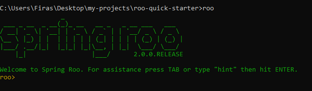
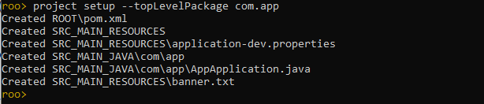
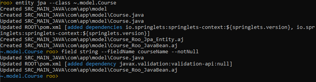
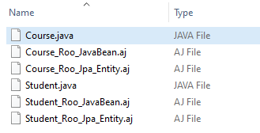
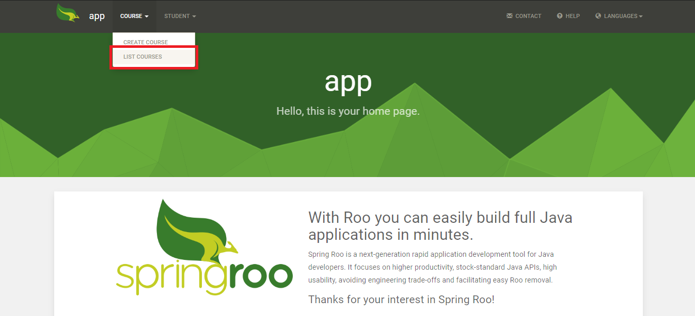
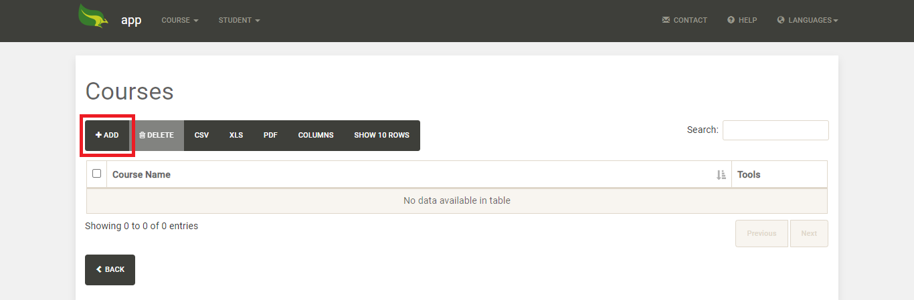
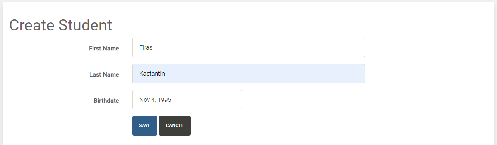
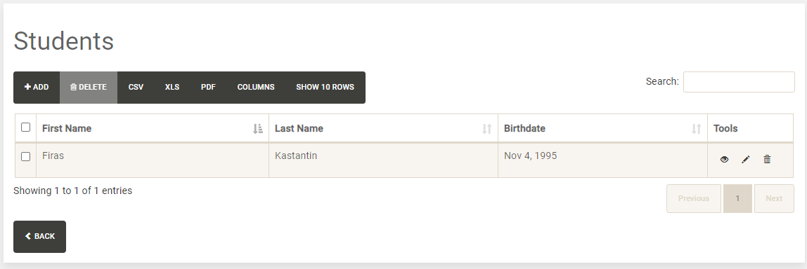
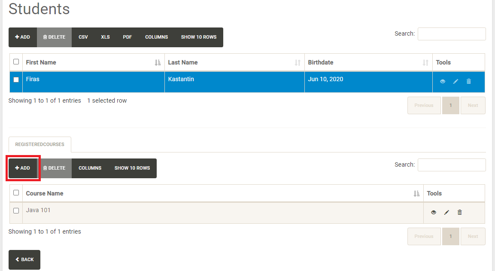
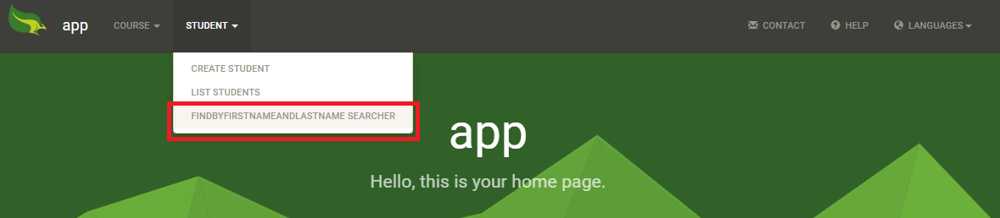

# Spring-Roo Quick Start

In this repo, I'm going to explore what is Spring-Roo, the functionalities that it provides and generate a small application with this amazing tool.

**Spring-Roo** *is an easy-to-use development tool for quickly building Spring-powered applications*. Spring-Roo is not a framework, it is a command-line tool that helps to generate high-quality web-based applications that rely on spring boot framework with fewer efforts.

We're going to build a basic **Student Management Application** that will help to manage students and their courses.

<br>
<br>

Every spring boot application consists of logically-separated components:

 - **Entities**: here you define your domain entities and the relationships between them. In our case we have two entities "Student" and "Course", and "Many-to-many" relationship between them.
  
 - **Repositories (Data access layer)**: every single entity should have the corresponding repository that interacts with the database. The repository is an interface that provides us with the basic CRUD operations.
 - **Services (Bussines logic layer)**: every single entity should have the corresponding service that interacts with the entity's repository (and other entities' repositories). The service also might contain data validation, your business logic, ... etc
 - **Controllers (Integration layer)**: this is the layer that other applications or your views interact with. The integration layer might be RESTful API, SOAP webservice or MVC controllers that return web pages.
 - **DTOs (Data transfer objects)**: here you define the structure of the messages that will be exchanged between your application and clients.

<br>

## Installation
At the time of writing, Spring-Roo 2.0.0 is the latest stable version. You can download from the project official page https://projects.spring.io/spring-roo.

After downloading the zip file, you can unzip it wherever you want on your computer. Then, you have to add the *'bin'* directory to your environment variables. In my case, I unzipped the downloaded file to *'E'* disk then added *'E:\spring-roo-2.0.0.RELEASE\bin'* to my environment variables.

## Project setup

 - You can choose the location where you want to create your application, then create a new folder.
 - Run *'cmd'* (or *'powershell'*) and change directory to the created folder.
    ```bash
    cd "C:\Users\Firas\Desktop\my-projects\roo-quick-starter"
    ```
 - Run *'roo'* command tool.
    ```bash
    roo
    ```
    
    <p align="center">
    
    </p>


 - You can press TAB for autocompleting your commands or type "hint" to help you for the next command.
 - You set up the project using *'project setup'* command, this will generate the project skeleton (pom.xml and top-level package).
    ```bash
    project setup --topLevelPackage com.app
    ```
    *'project setup'* command takes one required parameter *'topLevelPackage'*, which is the name of your top-level package. 
    Also, *'project setup'* command takes many other optional parameters, you can review them by press TAB after the command.
    
	<p align="center">
    
    </p>
	
 - The generated project is an ordinal maven-based spring boot application. *'log.roo'* file is a history of your executed commands.
 - We need to set up the JPA (database connection settings) using the *'JPA setup'* command. I will use HYPERSONIC_IN_MEMORY database, you can view the available supported databases by press TAB after --database.
     ```
     jpa setup --provider HIBERNATE --database HYPERSONIC_IN_MEMORY
    ```

## Generate entities

We need to create two entities:

- **Course** entity, has *'courseName'* field.
    ```bash
    entity jpa --class ~.model.Course
    field string --fieldName courseName --notNull
    ```
    The *'entity jpa'* command is used to generate an entity. It takes one required parameter '--class' which is the class name of your entity. 
    
    The class name starts with '~', which represents the top-level package of your application.

    The "field" command is used to add a field to your entity, the first parameter is the field type (string, number, date, ...etc), the second parameter is the field name, also it takes many other options, here we added *'notNull'* option.

    <p align="center">
        
    </p>

 - **Student** entity, has *'firstName'*, *'lastName'* and *'birthdate'* fields.
     ```bash
    entity jpa --class ~.model.Student 
    field string --fieldName firstName --notNull
    field string --fieldName lastName --notNull
    field date --fieldName birthdate --type java.util.Date --notNull
     ```
 - There is a many-to-many relationship between them. We can create a one-to-one relationship using *'reference'* field type, we can create a one-to-many or many-to-many relationship using *'set'* field type by specifying the *'cardinality'* parameter.
     ```bash
    field set --fieldName registeredCourses --type ~.model.Course --cardinality MANY_TO_MANY  
     ```
 
 Let's check the created files under the model package.
         
<p align="center">
    
</p>

For every single entity, we have three files were generated. *'Course.java'* contains your entity fields, you can change immediately on *'\*.java'* files when needed. *'\*.aj'* files are managed by spring roo, you shouldn't change on them immediately. During the compile time, *'\*.java'* and *'\*.aj'* will be merged to generate one java class.

If you want to change on *'\*.aj'* files, you have to merge them first with the *'push-in'* command:
```
push-in --class ~.model.Course
```
You may notice that the *'field'* command doesn't take the class name as parameter, you have to focus on the desired entity using *'focus'* command before adding new field.
```
focus --class ~.model.Course
```

## Generate repositories

You can generate repositories using *'repository jpa'* command. You can use *'--all'* to generate all entities' repositories or *'--entity'* to generate repository for a certain entity.
```
repository jpa --all
```

## Generate services
In the same way, you can use the *'service'* command.
```
service --all
```
## Generate web controllers
First, you need to set up web MVC, this will generate the need classes and settings.
```
web mvc setup
```
Spring roo provides two options for you controllers:

 - **Json controllers**: you can use this option if you want to generate RESTful API that will be consumed by your clients.
    ```
    web mvc controller --all --responseType JSON
    ```

 - **Thymeleaf controllers**: Thymeleaf is a modern server-side Java template engine is used to render HTML pages.

For our tutorial, we're going to use Thymeleaf. You need first to set up Thymeleaf skeleton and layouts.
```
web mvc view setup --type THYMELEAF
```
Now we can generate our controllers. In the same way, we generated our services, we can generate our controllers at once *'--all*'.

```
web mvc controller --all --responseType THYMELEAF
```
Let's try our generated application. You can run it like any other maven-based spring boot application, open a new cmd and change directory to your project's directory (It may take some minutes to download the dependencies):
```
mvn spring-boot:run
```
Note: you may need to change the spring roo repository url from http to https in the *pom.xml* file.

Open your browser: http://localhost:8080

<br>

<p align="center">
    
</p>
<br>
<p align="center">
    
</p>
Let's add a new course.
<br><br>

<p align="center">
    
</p>
In the same way, let's create a new student.
<br><br>
<p align="center">
    
</p>
<br>
<p align="center">
    
</p>

You may have noticed that there is no feasibility in the generated application to add a course for a student or view the related courses for a certain student. You can do that by generating detail for your entity.

### Generate details 
You can use *'web mvc detail'* command when you have a one-to-many or many-to-many relationship and you want to show the related entity instances of your entity.

```
web mvc detail --entity ~.model.Student --field registeredCourses --responseType THYMELEAF
```
The *'--field'* parameter is the field name of your entity that you want its detail to be shown.

<p align="center">
    
</p>

### Generate finders
 A finder is a search form, you can generate finder for your entity with the desired form parameters. In our case, we are going to generate a finder for the student entity with two parameters *'firstName'* and *'lastName'*.

First, you have to generate DTO that contains your form parameters.
```
dto --class ~.dto.StudentSearchDto
field string --fieldName firstName
field string --fieldName lastName
```
Then, we generate desired finder using *'finder add'* command:
```
finder add --entity ~.model.Student --name findByFirstNameAndLastName --formBean ~.dto.StudentSearchDto
```
You should provide entity name, dto name and finder name (Finder name should follow spring JPA notation).

Finally, we generate finder form and report:
```
web mvc finder --entity ~.model.Student --queryMethod findByFirstNameAndLastName --responseType THYMELEAF
```
<p align="center">
    
</p>

You can reach the executed commands from here: [log.roo](log.roo)